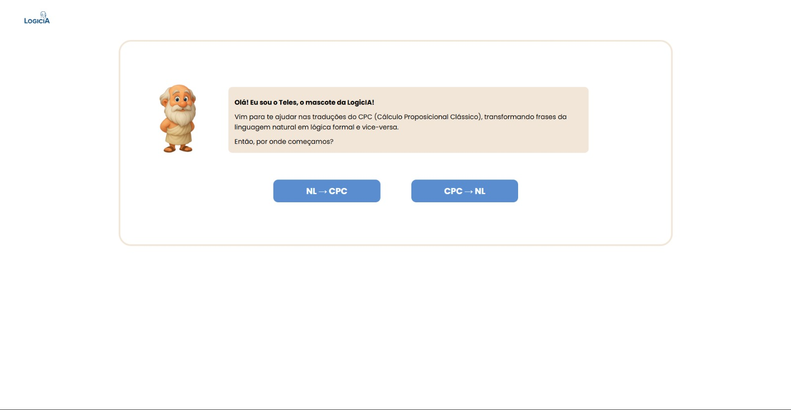
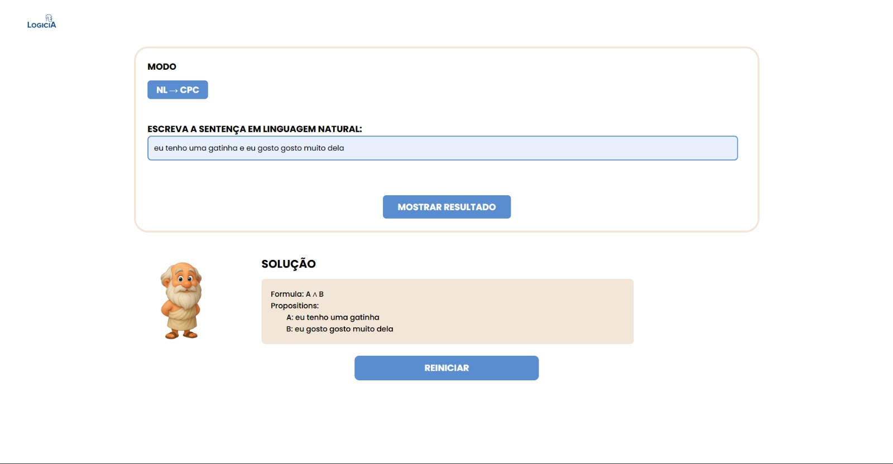

# LogicIA - NL ↔ CPC Translator  
**Natural Language ⇄ Classical Propositional Logic**  

[Overview](#overview) • [Features](#features) • [Project Structure](#project-structure) • [Installation](#installation) • [Frontend Setup](#frontend-setup-react) • [Project Routes](#project-routes) • [Future Improvements](#future-improvements) • [License](#license)


# Overview

LogicIA is an intelligent translator that converts **natural language (NL)** sentences into **Classical Propositional Calculus (CPC)** formulas - and converts CPC back into natural language. Language support is universal because AI handles the translation layer.

Try the proect here: 

-------------------------------------------------- https://logic-ia.vercel.app/ -------------------------------------------------

Overview Video:

--------------------------------------- https://www.youtube.com/watch?v=K9-ol0s8hb ------------------------------------

It uses:

- **FastAPI (Python)** as backend  

- **Google Gemini 2.5 Flash** for AI-powered translation  

- **Regex fallback logic**  

- **React + Vite** as frontend  

<br>
<br>

# Features

### NL → CPC (Natural Language to Classical Propositional Calculus)

- The user provides a sentence in natural language (any language)
- The backend constructs a structured prompt with explicit mapping rules for the AI model.
- The LLM (Gemini) identifies propositions, assigns letters from **A to T**, and applies logical operators based on the mapping rules:
  - `"and" / "e" / "também" / "tambem"` → `∧`
  - `"or" / "ou"` → `v`
  - `"not" / "não" / "nao"` → `¬`
  - `"if ... then / se... então"` → `→`
  - `"if and only if" / "se e somente se" / "somente se"` → `↔`
- After interpreting and structuring the logical formula, the model returns a strict JSON object containing:
  - The generated formula  
  - All mapped propositions  
- This JSON is consumed by the frontend and displayed to the user.

<br>


### CPC → NL (Classical Propositional Calculus to Natural Language)

- The user provides a logical formula using CPC notation. Proposition meanings may be included but are optional.
- The backend sends a prompt instructing the LLM to convert symbols back into natural-language expressions:
  - `∧` → `"and"`
  - `v` → `"or"`
  - `¬` → `"not"`
  - `→` → `"then"`
  - `↔` → `"if and only if"`
- If the user does not provide proposition meanings, the system automatically generates friendly descriptions using “cute animal” themes (e.g., Brownie the rabbit, Lya the cat, Catarina the cat, Sheldon the cat).
- The model returns a JSON object containing:
  - The natural-language translation  
  - The full set of generated or provided propositions  
- The frontend formats and displays the result to the user.

<br>
<br>

# Project Structure
```
LOGICIA/
│
├── App/                          # Frontend (React + Vite)
│   ├── public/
│   ├── src/
│   │   ├── assets/
│   │   ├── components/
│   │   │   ├── css/
│   │   │   ├── box.jsx
│   │   │   └── header.jsx
│   │   ├── pages/
│   │   │   ├── css/style.css
│   │   │   ├── cpc.jsx
│   │   │   ├── home.jsx
│   │   │   ├── introduction.jsx
│   │   │   └── nl.jsx
│   │   ├── App.css
│   │   ├── App.jsx
│   │   ├── index.css
│   │   └── main.jsx
│   └── vite.config.js
├── home.py                       # Backend routes
├── main.py                       # FastAPI entrypoint
├── schemas.py                    # Pydantic models
├── requirements.txt   
├── README.md                     
└── .env
```
<br>
<br>

# Installation 

### 1️. Clone the repository
```
git clone https://github.com/cauerast/LogicIA.git
cd LogicIA
```

### 2. Create a virtual environment
```
py -m venv .venv
```

### 3. Install dependencies
```
py -m pip install -r requirements.txt
```

### 4. Configure Environment Variables (.env)

```
(create .env first) ->

GEMINI_API_KEY=YOUR_KEY_HERE
```

### 5. Start FastAPI
```
py -m uvicorn main:app --reload
```
### Avaliable at FastAPI → http://localhost:8000/docs

<br>
<br>

# Frontend Setup (React)

```
cd App
npm init -y
npm install
npm install react-router-dom
npm run dev
```
### Your interface will be available at: http://localhost:5173

<br>
<br>

# Project Routes
## Home


<br>

## Introduction


<br>

## NL to CPC



<br>

### CPC to NL


### If propositions are missing, the backend auto-generates cute-animal statements :)


<br>
<br>

# Future Improvements

### Formal Logical Validation Layer

- verify WFF structure,

- detect invalid formulas,

- simplify expressions (e.g., via truth tables or logical identities).

- Custom Proposition Generator

### Allow users to choose themes and save history:

- animals,

- tech,

- daily scenarios,

- academic terms,

- or even custom labels.

### Improved Error Messages, create a clearer feedback system explaining:

- which part of the input failed,

- why it failed,

- and how to fix it.
<br>
<br>

## Contributors

This project was developed collaboratively by a motivated and dedicated dream team:

* **[Cauê Rast](https://github.com/cauerast)** - Backend Developer & Project Lead
* **[Igor Carvalho](https://github.com/iccarvalho)** - Backend Developer
* **[Rosa](https://github.com/rosa7788)** - Frontend Developer
* **[Pedro de Paula](https://github.com/dePaula06)** - Frontend Developer
* **[Miguel Henrique](https://github.com/MiguelHenriqueO)** - Frontend Developer

<br>
<br>

# License

### MIT License - free for personal, academic, or commercial use.
